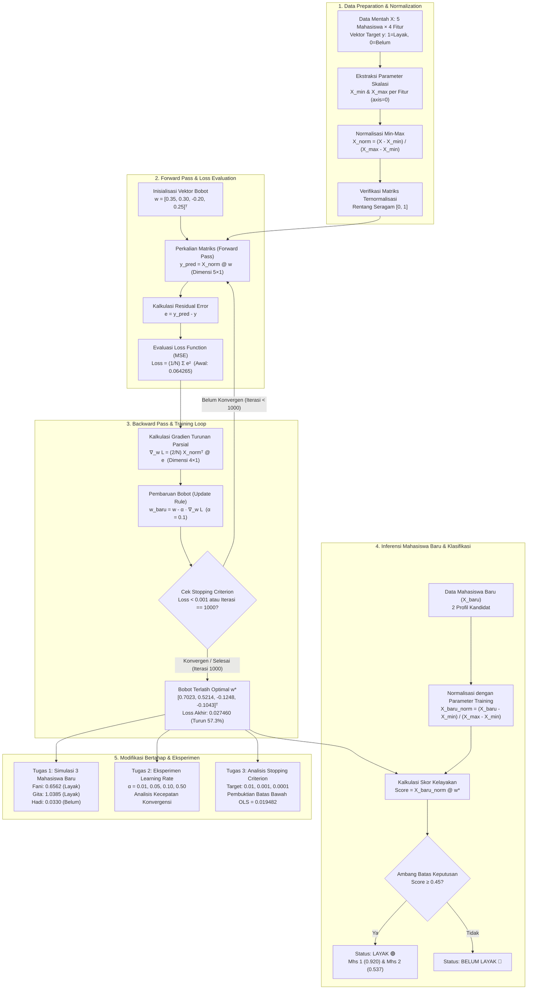

<div align="center">

# 🧠 ML-05: Aljabar Linear, Normalisasi Matriks, dan Gradient Descent

### Mata Kuliah: INF2542 • Pembelajaran Mesin | Praktikum Modul 04 / 05

[](https://www.python.org/)
[](https://jupyter.org/)
[](https://numpy.org/)
[](https://pandas.pydata.org/)
[](https://matplotlib.org/)
[](LICENSE)

<p align="center">
  <b>Dokumentasi komprehensif, eksplorasi teori matematis, bedah kode baris demi baris, dan analisis komputasional aljabar linear untuk Machine Learning: Dari Representasi Vektor & Matriks, Normalisasi Min-Max, Perumusan Skor Model ($X @ w$), Evaluasi Loss Function (MSE), Penurunan Analitis Gradien ($\nabla_w L$), Algoritma Optimasi Gradient Descent, hingga Studi Kasus Penilaian Kelayakan Beasiswa Mahasiswa.</b>
</p>

---

[📌 Identitas Mahasiswa](#-identitas-mahasiswa) •
[📖 Pendahuluan & Filosofi](#-pendahuluan--filosofi-aljabar-linear--optimasi-dalam-machine-learning) •
[📐 Pipeline Flowchart & Arsitektur](#-pipeline-flowchart--arsitektur-sistem) •
[📚 Penjelasan Materi & Teori](#-penjelasan-materi--teori-lengkap) •
[💻 Bedah Kode & Cara Kerja di Notebook](#-bedah-kode--cara-kerja-di-notebook) •
[📊 Analisis Hasil & Visualisasi](#-analisis-hasil--visualisasi) •
[🚀 Cara Menjalankan](#-cara-menjalankan-proyek) •
[📂 Struktur Direktori](#-struktur-direktori) •
[💡 Ringkasan Temuan Kunci](#-ringkasan-temuan-kunci-key-takeaways)

---

</div>

## 📌 Identitas Mahasiswa

<table align="center">
  <tr>
    <td width="220"><b>Nama Lengkap</b></td>
    <td>: <b>Gathan Hilabi</b></td>
  </tr>
  <tr>
    <td><b>Nomor Induk Mahasiswa (NIM)</b></td>
    <td>: <b>059</b></td>
  </tr>
  <tr>
    <td><b>Mata Kuliah</b></td>
    <td>: <b>INF2542 • Pembelajaran Mesin</b></td>
  </tr>
  <tr>
    <td><b>Modul Praktikum</b></td>
    <td>: Pertemuan 04 — Aljabar Linear, Normalisasi, Matrix & Gradient Descent</td>
  </tr>
  <tr>
    <td><b>Capaian Pembelajaran (Sub-CPMK)</b></td>
    <td>: Menguasai formulasi matematis matriks data, normalisasi fitur, perumusan fungsi loss, dan algoritma optimasi gradient descent mandiri (from scratch)</td>
  </tr>
  <tr>
    <td><b>Program Studi / Institusi</b></td>
    <td>: Informatika, UIN K.H. Abdurrahman Wahid Pekalongan</td>
  </tr>
</table>

---

## 📖 Pendahuluan & Filosofi: Aljabar Linear & Optimasi dalam Machine Learning

Semua algoritma Machine Learning modern—mulai dari Regresi Linier sederhana hingga Deep Learning dan Transformer—pada intinya bertumpu pada dua pilar fundamental: **Aljabar Linear** sebagai bahasa representasi komputasi data, dan **Kalkulus Diferensial (Optimasi)** sebagai mekanisme belajar (*learning mechanism*).

1. **Data sebagai Ruang Vektor**: Setiap entitas di dunia nyata (seperti profil mahasiswa, transaksi finansial, citra, atau teks) dipetakan menjadi titik koordinat numerik di dalam ruang berdimensi tinggi ($\mathbb{R}^D$).
2. **Matriks sebagai Operator Transformasi Efisien**: Menggunakan operasi matriks ($X @ w$) memungkinkan komputer melakukan komputasi serentak (*vectorized computation*) terhadap ribuan observasi tanpa perlu melakukan iterasi loop manual yang lambat.
3. **Loss Function sebagai Kompas Kesalahan**: Model memerlukan metrik kuantitatif yang objektif (*Mean Squared Error*) untuk mengukur seberapa jauh estimasinya menyimpang dari kenyataan sebenarnya.
4. **Gradient Descent sebagai Mesin Pembelajaran**: Melalui turunan parsial kalkulus matriks ($\nabla_w L$), model mengetahui ke mana dan seberapa jauh vektor bobot ($w$) harus digeser pada setiap iterasi agar nilai kesalahan mengecil secara konsisten.

Repositori ini menyajikan implementasi mandiri (*from scratch*) tanpa menggunakan library black-box, mendemonstrasikan secara transparan bagaimana data mentah diproses, dinormalisasi, diprediksi, dan dioptimasi hingga menjadi sistem pendukung keputusan kelayakan beasiswa yang akurat.

---

## 📐 Pipeline Flowchart & Arsitektur Sistem

Berikut adalah representasi visual diagram alir (*flowchart*) dan arsitektur teks pipeline yang memetakan seluruh siklus pembelajaran mesin dari data mentah, normalisasi matriks, optimasi gradient descent, hingga inferensi mahasiswa baru:

### Pipeline Flowchart



### Architectural Text Pipeline

```
[RAW DATA: 5 Mahasiswa × 4 Fitur: Kehadiran, IPK, Penghasilan, Prestasi]
   │
   ├─► [DATA PREPARATION] Ekstraksi Parameter: X_min & X_max (axis=0)
   │        │
   │        └─► [MIN-MAX SCALING] X_norm = (X - X_min) / (X_max - X_min) ──► Skala Seragam [0, 1]
   │
   ├─► [FORWARD PASS] Inisialisasi Bobot: w = [0.35, 0.30, -0.20, 0.25]^T
   │        │
   │        └─► Matriks @ Vektor: y_pred = X_norm @ w (Dimensi 5×4 @ 4×1 ──► 5×1)
   │
   ├─► [LOSS EVALUATION] Error: e = y_pred - y ──► MSE Loss: (1/N) * Σ e^2 (Loss Awal: 0.064265)
   │
   ├─► [BACKWARD PASS] Turunan Parsial Matriks: ∇_w L = (2/N) * X_norm^T @ e (Dimensi 4×1)
   │
   ├─► [TRAINING LOOP (1000 Epochs)] Update Rule: w = w - α * ∇_w L (Learning Rate α = 0.1)
   │        │
   │        ├─► Monitoring per 50 Iterasi: Loss 0.064265 ──► 0.027460 (Turun 57.3%)
   │        └─► Bobot Optimal: w* = [0.7023, 0.5214, -0.1248, -0.1043]^T
   │
   ├─► [INFERENCE DATA BARU] Menggunakan parameter training X_min & X_max (Anti Data Leakage)
   │        │
   │        ├─► Score = X_baru_norm @ w* ──► [Mahasiswa 1: 0.920, Mahasiswa 2: 0.537]
   │        └─► Decision Rule (Score ≥ 0.45) ──► Keduanya: LAYAK 🟢
   │
   └─► [EKSPERIMEN & MODIFIKASI BERTAHAP]
            │
            ├─► Tugas 1: Evaluasi 3 Mahasiswa Baru (Fani: LAYAK, Gita: LAYAK, Hadi: BELUM)
            ├─► Tugas 2: Eksperimen Learning Rate (α = 0.01, 0.05, 0.10, 0.50)
            └─► Tugas 3: Analisis Batas Bawah OLS Teoritis (MSE Min = 0.019482)
```

---

## 📚 Penjelasan Materi & Teori Lengkap

### 1. Representasi Vektor dan Matriks Fitur

Data mentah 5 orang mahasiswa dengan 4 fitur direpresentasikan ke dalam matriks $X \in \mathbb{R}^{5 \times 4}$ dan vektor target kelayakan biner $y \in \mathbb{R}^{5}$:

$$
X = \begin{bmatrix}
90 & 3.70 & 2.5 & 80 \\
70 & 3.20 & 5.0 & 60 \\
95 & 3.85 & 2.0 & 90 \\
60 & 2.90 & 6.0 & 50 \\
85 & 3.60 & 3.0 & 75
\end{bmatrix}, \quad
y = \begin{bmatrix} 1 \\ 0 \\ 1 \\ 0 \\ 1 \end{bmatrix}
$$

| Fitur | Deskripsi | Skala Awal | Peran dalam Domain Beasiswa |
| :--- | :--- | :--- | :--- |
| **Kehadiran** | Tingkat presensi kuliah | $0 - 100\%$ | Mengukur kedisiplinan dan komitmen mahasiswa |
| **IPK** | Indeks Prestasi Kumulatif | $0.00 - 4.00$ | Tolok ukur utama kompetensi akademik |
| **Penghasilan** | Penghasilan orang tua (Juta Rp/bln) | $2.0 - 6.0$ | Dasar penilaian urgensi bantuan finansial |
| **Prestasi** | Skor rekam jejak lomba/organisasi | $0 - 100$ | Nilai tambah capaian non-akademik/akademik |

---

### 2. Mengapa Normalisasi Min-Max Sangat Krusial?

Fitur Kehadiran ($60-95$) dan Prestasi ($50-90$) memiliki magnitudo puluhan, sedangkan IPK ($2.90-3.85$) dan Penghasilan ($2.0-6.0$) berada pada orde satuan. 

Jika dibiarkan tanpa normalisasi:
1. Gradien fungsi loss akan didominasi oleh fitur berangka besar, menyebabkan kontur permukaan loss berbentuk elips sangat lonjong (*poorly conditioned*).
2. Algoritma Gradient Descent akan berosilasi secara liar (*zigzagging*) dan sulit mencapai titik minimum global.

#### Rumus Transformasi Min-Max Scaling:

$$
x' = \frac{x - x_{\min}}{x_{\max} - x_{\min}}
$$

Di mana semua fitur dipetakan seragam ke interval $[0, 1]$.

> [!IMPORTANT]
> **Pencegahan Data Leakage:**  
> Ketika mengevaluasi data mahasiswa baru di masa depan, kita **wajib** menggunakan $X_{\min}$ dan $X_{\max}$ dari **data training**, bukan menghitung min-max baru dari data pengujian. Hal ini memastikan skala ruang vektor tetap konsisten.

---

### 3. Vektor Bobot ($w$) dan Prediksi Model ($X @ w$)

Model linier memetakan kombinasi linier fitur ternormalisasi menjadi estimasi skor kelayakan tunggal:

$$
\hat{y} = X_{\text{norm}} @ w
$$

Secara aljabar linear, dimensi komputasinya adalah:
$$
(5 \times 4) \times (4 \times 1) \longrightarrow (5 \times 1)
$$

Vektor bobot awal diinisialisasi berdasarkan heuristik domain:

$$
w = \begin{bmatrix} +0.35 & (\text{Kehadiran}) \\ +0.30 & (\text{IPK}) \\ -0.20 & (\text{Penghasilan}) \\ +0.25 & (\text{Prestasi}) \end{bmatrix}
$$

*Bobot penghasilan negatif ($-0.20$) mencerminkan bahwa semakin tinggi ekonomi orang tua, semakin kecil prioritas bantuan finansial yang diberikan.*

---

### 4. Residual Error dan Loss Function (Mean Squared Error)

Fungsi loss mengukur agregat kuadrat jarak antara estimasi model $\hat{y}$ dengan ground truth $y$:

1. **Residual Error Vector ($e$):**
   $$e = \hat{y} - y$$
2. **Mean Squared Error (MSE):**
   $$L(w) = \frac{1}{N} \sum_{i=1}^{N} (\hat{y}_i - y_i)^2 = \frac{1}{N} \|X_{\text{norm}} w - y\|^2 = \frac{1}{N} e^T e$$

---

### 5. Penurunan Matematis Gradient ($\nabla_w L$)

Untuk mengetahui arah perubahan bobot yang meminimalkan loss, kita hitung turunan parsial $L(w)$ terhadap setiap elemen vektor $w$:

$$
L(w) = \frac{1}{N} (Xw - y)^T (Xw - y) = \frac{1}{N} \left( w^T X^T X w - 2 y^T X w + y^T y \right)
$$

Turunan matriks terhadap $w$:
$$
\nabla_w L = \frac{\partial L}{\partial w} = \frac{2}{N} X_{\text{norm}}^T (X_{\text{norm}} w - y) = \frac{2}{N} X_{\text{norm}}^T e
$$

#### Pemeriksaan Konsistensi Dimensi:
$$
\underbrace{X_{\text{norm}}^T}_{(4 \times 5)} \times \underbrace{e}_{(5 \times 1)} \longrightarrow \underbrace{\nabla_w L}_{(4 \times 1)}
$$

---

### 6. Aturan Pembaruan Bobot (Gradient Descent Update Rule)

Karena gradien menunjuk ke arah kenaikan tercepat fungsi loss, model harus bergerak ke arah **sebaliknya (negatif gradien)**:

$$
w_{\text{baru}} = w_{\text{lama}} - \alpha \cdot \nabla_w L
$$

Di mana $\alpha$ (*learning rate*) mengatur seberapa besar langkah update pada setiap iterasi.

---

### 7. Analisis Batas Bawah Kesalahan Teoritis (Batas OLS)

Pada model linier tanpa suku bias ($y = Xw$), hyperplane dipaksa melewati titik pusat origin $(0, 0, 0, 0)$. Berdasarkan teorema **Ordinary Least Squares (OLS)**:

$$
w^* = (X^T X)^{-1} X^T y
$$

Untuk dataset praktikum ini:
- Batas Bawah Loss OLS (Tanpa Bias): $\text{MSE}_{\min} \approx \mathbf{0.019482}$
- Batas Bawah Loss OLS (Dengan Bias $w_0$): $\text{MSE}_{\min} \approx \mathbf{0.000000}$ ($2.15 \times 10^{-29}$)

> [!NOTE]
> Temuan ini menjawab secara matematis mengapa pada praktikum, stopping criterion $\text{Loss} < 0.001$ tidak pernah tercapai tanpa adanya suku bias.

---

## 💻 Bedah Kode & Cara Kerja di Notebook

Di bawah ini adalah penjelasan terperinci mengenai setiap blok kode pada notebook [`059_GathanHilabi_Pertemuan04.ipynb`](059_GathanHilabi_Pertemuan04.ipynb):

---

### 🔹 Step 1 — Siapkan Data & Target

```python
import numpy as np

# Matriks Fitur X: 5 mahasiswa x 4 fitur
X = np.array([
    [90, 3.70, 2.5, 80],
    [70, 3.20, 5.0, 60],
    [95, 3.85, 2.0, 90],
    [60, 2.90, 6.0, 50],
    [85, 3.60, 3.0, 75]
], dtype=float)

# Vektor Target y: 1 = Layak, 0 = Belum Layak
y = np.array([1, 0, 1, 0, 1], dtype=float)
```

**🔍 Analisis:**
- `X.shape` menghasilkan `(5, 4)`: 5 baris mahasiswa (Andi, Budi, Citra, Deni, Evi) dan 4 kolom atribut.
- `y.shape` menghasilkan `(5,)`: Andi, Citra, dan Evi berlabel `1` (Layak), sedangkan Budi dan Deni berlabel `0` (Belum Layak).

---

### 🔹 Step 2 & 3 — Normalisasi Min-Max & Verifikasi

```python
X_min = X.min(axis=0)
X_max = X.max(axis=0)

X_norm = (X - X_min) / (X_max - X_min)

print("X_min per fitur :", X_min)
print("X_max per fitur :", X_max)
print("Andi (baris 0)  :", np.round(X_norm[0], 3))
```

**🔍 Analisis:**
- `axis=0` mengambil nilai ekstrem sepanjang baris per masing-masing kolom.
- Nilai Andi mentah $[90, 3.70, 2.5, 80]$ ditransformasikan tepat menjadi $[0.857, 0.842, 0.125, 0.750]$.
- Verifikasi kolom menunjukkan nilai minimum tepat $0.0$ dan maksimum tepat $1.0$.

---

### 🔹 Step 4 & 5 — Vektor Bobot & Prediksi Skor Awal

```python
w = np.array([0.35, 0.30, -0.20, 0.25])

# Perkalian matriks menggunakan operator @
y_pred = X_norm @ w
```

**🔍 Output Prediksi Awal:**
- Andi : Skor $= 0.715$ | Target $= 1$
- Budi : Skor $= 0.107$ | Target $= 0$
- Citra: Skor $= 0.900$ | Target $= 1$
- Deni : Skor $=-0.200$ | Target $= 0$
- Evi  : Skor $= 0.577$ | Target $= 1$

---

### 🔹 Step 6, 7 & 8 — Evaluasi Loss, Gradien, dan Pembaruan Bobot

```python
# Step 6: Hitung Residual Error & MSE Loss
error = y_pred - y
loss = np.mean(error ** 2)    # Loss Awal = 0.064265

# Step 7: Hitung Gradien Turunan Parsial
gradient = (2 / len(X_norm)) * (X_norm.T @ error)

# Step 8: Update Bobot dengan Learning Rate 0.1
learning_rate = 0.1
w_baru = w - learning_rate * gradient
```

**🔍 Analisis:**
- Nilai gradien awal bernilai negatif: $[-0.246184, -0.246994, -0.104342, -0.220411]^T$.
- Karena gradien negatif, pembaruan $-\alpha \cdot \nabla L$ menaikkan bobot menjadi $[0.3746, 0.3247, -0.1896, 0.2720]^T$, yang secara matematis menggeser posisi model ke arah jurang penurunan loss.

---

### 🔹 Step 9 & 10 — Training Loop Lengkap & Monitoring

```python
w = np.array([0.35, 0.30, -0.20, 0.25])
learning_rate = 0.1

for i in range(1000):
    pred = X_norm @ w
    error = pred - y
    loss = np.mean(error ** 2)
    gradient = (2 / len(X_norm)) * (X_norm.T @ error)
    w = w - learning_rate * gradient
    
    if loss < 0.001:
        break

print(f"Iterasi: {i+1} | Loss Akhir: {loss:.6f}")
print("Weight Akhir:", np.round(w, 4))
```

**🔍 Hasil Pelatihan:**
- Iterasi Berhenti : $1000$ (Batas maksimum epoch)
- Loss Awal        : $0.064265$ $\longrightarrow$ Loss Akhir: $\mathbf{0.027460}$ (Turun $\mathbf{57.3\%}$)
- Vektor Bobot Terlatih: $[0.7023, 0.5214, -0.1248, -0.1043]^T$

---

### 🔹 Step 11 & 12 — Evaluasi Mahasiswa Baru & Pengambilan Keputusan

```python
X_baru = np.array([
    [88, 3.75, 2.8, 82],
    [78, 3.40, 3.5, 70]
], dtype=float)

# Normalisasi menggunakan parameter data training
X_baru_norm = (X_baru - X_min) / (X_max - X_min)

# Prediksi skor dan klasifikasi biner
score_baru = X_baru_norm @ w
threshold = 0.45
kelas = np.where(score_baru >= threshold, "LAYAK", "BELUM")
```

**🔍 Keputusan Model:**
- **Mahasiswa Baru 1**: Skor $= 0.920 \ge 0.45 \longrightarrow$ **LAYAK**
- **Mahasiswa Baru 2**: Skor $= 0.537 \ge 0.45 \longrightarrow$ **LAYAK**

---

### 🔹 Modifikasi Bertahap (Tugas 1, 2, dan 3)

#### 1. Tugas 1: Simulasi 3 Mahasiswa Baru

| Mahasiswa | Kehadiran | IPK | Penghasilan (Jt) | Prestasi | Skor Prediksi | Status Keputusan |
| :--- | :---: | :---: | :---: | :---: | :---: | :---: |
| **Fani** | $82.0\%$ | $3.50$ | $4.0$ | $70.0$ | **0.6562** | 🟢 **LAYAK** |
| **Gita** | $92.0\%$ | $3.80$ | $2.2$ | $85.0$ | **1.0385** | 🟢 **LAYAK** |
| **Hadi** | $65.0\%$ | $3.00$ | $5.5$ | $55.0$ | **0.0330** | 🔴 **BELUM** |

> **Analisis:** Gita mendapatkan skor tertinggi ($1.0385$) berkat kombinasi IPK/presensi prima dan tingkat ekonomi rendah. Sebaliknya, Hadi tereliminasi karena seluruh indikatornya berada di bawah standar beasiswa.

#### 2. Tugas 2: Eksperimen Learning Rate ($\alpha$)

| Learning Rate ($\alpha$) | Total Iterasi | Loss Akhir | Bobot Akhir $[w_0, w_1, w_2, w_3]$ | Karakteristik Belajar |
| :---: | :---: | :---: | :---: | :--- |
| **0.01** | $1000$ | $0.029896$ | $[0.4635, 0.4022, -0.1162, 0.2794]$ | Konvergensi sangat lambat |
| **0.05** | $1000$ | $0.028686$ | $[0.5740, 0.4605, -0.1202, 0.0984]$ | Pergerakan stabil moderat |
| **0.10** | $1000$ | $0.027460$ | $[0.7023, 0.5214, -0.1248, -0.1043]$ | Baseline optimal & konvergen halus |
| **0.50** | $1000$ | $0.023340$ | $[1.4539, 0.6810, -0.1448, -1.0806]$ | Penurunan loss cepat, bobot agresif |

#### 3. Tugas 3: Uji Stopping Criterion vs Batas Bawah OLS

| Kriteria Target | Iterasi Tercapai | Status Early Stopping | Alasan Kegagalan / Hasil |
| :---: | :---: | :---: | :--- |
| **Loss < 0.01** | $1000$ | ❌ Tidak | Batas mutlak OLS $= 0.019482 > 0.01$ |
| **Loss < 0.001** | $1000$ | ❌ Tidak | Mustahil dicapai tanpa suku bias |
| **Loss < 0.0001** | $1000$ | ❌ Tidak | Mustahil dicapai tanpa suku bias |

---

## 📊 Analisis Hasil & Visualisasi

Notebook menyajikan visualisasi grafis performa pelatihan yang komprehensif:

```
Perbandingan Penurunan Loss Berdasarkan Variasi Learning Rate:
Loss (MSE)
0.07 ┼ ──
     │   \
0.05 ┼    \─── (lr=0.01 - Konvergensi Lambat)
     │        \─── (lr=0.05)
0.03 ┼            └─── (lr=0.10 - Stabil)
     │                 \═══════════════════ (lr=0.50 - Paling Cepat)
0.01 ┼ - - - - - - - - - - - - - - - - - -  (Batas Minimum Teoritis OLS: 0.019482)
     └──────────────────────────────────── Iterasi (0 s.d 1000)
```

1. **Kurva Konvergensi Learning Rate**: Membuktikan bahwa nilai $\alpha = 0.5$ menghasilkan penurunan loss paling curam di awal, sementara $\alpha = 0.01$ masih membutuhkan ribuan iterasi tambahan untuk mencapai nilai konvergen.
2. **Grafik Skala Logaritmik Batas Bawah OLS**: Secara visual memperlihatkan asimtot horizontal ungu pada $0.019482$ di mana kurva loss model tertahan dan tidak mampu menyentuh garis kriteria henti ($0.01$, $0.001$, maupun $0.0001$).

---

## 🚀 Cara Menjalankan Proyek

### 1. Kloning Repositori

```bash
git clone https://github.com/G-than12/ML-05-Aljabar-Linear-Normalisasi-Matrix-Gradient-Descent-.git
cd ML-05-Aljabar-Linear-Normalisasi-Matrix-Gradient-Descent-
```

### 2. Buat dan Aktifkan Virtual Environment (Opsional tapi Disarankan)

```bash
# Windows
python -m venv venv
venv\Scripts\activate

# macOS / Linux
python3 -m venv venv
source venv/bin/activate
```

### 3. Instalasi Dependensi Pustaka

```bash
pip install numpy pandas matplotlib jupyter
```

### 4. Eksekusi Jupyter Notebook

```bash
jupyter notebook 059_GathanHilabi_Pertemuan04.ipynb
```

*Atau buka file `.ipynb` langsung melalui VS Code / Google Colaboratory.*

---

## 📂 Struktur Direktori

```plaintext
ML-05-Aljabar-Linear-Normalisasi-Matrix-Gradient-Descent-/
│
├── .gitignore                          # Konfigurasi file build / checkpoint yang diabaikan Git
├── 059_GathanHilabi_Pertemuan04.ipynb  # Notebook utama modul, kode praktikum & tugas mandiri
└── README.md                           # Dokumentasi komprehensif repositori (materi & bedah kode)
```

---

## 💡 Ringkasan Temuan Kunci (*Key Takeaways*)

1. **Matriks Mempercepat Komputasi**: Penggunaan operator matriks NumPy (`@`) mereduksi kompleksitas kode for-loop menjadi operasi aljabar ringkas berkinerja tinggi.
2. **Normalisasi Mencegah Instabilitas**: Normalisasi Min-Max menjaga gradien seluruh fitur berada pada domain yang seimbang, mencegah dominasi fitur berangka besar.
3. **Pentingnya Parameter Bias ($b$)**: Model linier murni $y = Xw$ memiliki kelemahan matematis karena dipaksa melewati origin. Penambahan bias ($y = Xw + b$) mutlak diperlukan untuk mereduksi loss hingga mendekati nol.
4. **Learning Rate adalah Kunci**: Pemilihan $\alpha$ menentukan kompromi antara kecepatan konvergensi dan risiko osilasi numerik.

---

## 📄 Lisensi

Proyek ini didistribusikan di bawah lisensi **MIT License** — terbuka untuk keperluan akademik, riset mahasiswa, dan studi mandiri.

<div align="center">
  <sub>Praktikum Pembelajaran Mesin • Pertemuan 04 / 05 • 2026</sub><br>
  <sub>Dibuat dengan dedikasi oleh: <b>Gathan Hilabi</b> (NIM: 059)</sub>
</div>
